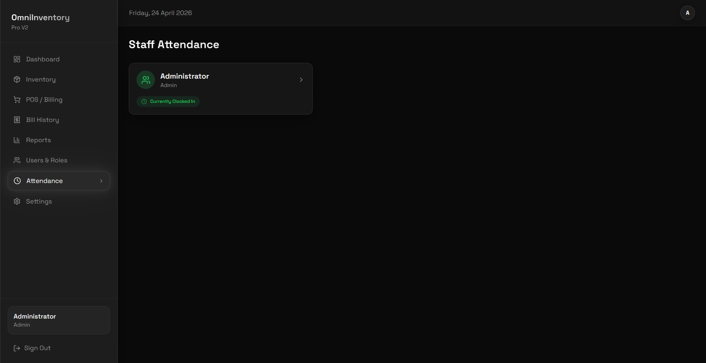

<p align="center">
  
</p>

<h1 align="center">Omni Inventory Pro</h1>

<p align="center">A full-featured, offline-first desktop inventory management system built for small businesses.</p>


---

## About the Project

Omni Inventory Pro V2.1.0 builds on V2.0.0 with a significant backend overhaul. The database layer has been migrated from raw SQLite queries to **Prisma ORM**, giving the app a proper schema-managed database with full relational support. Authentication is now handled via **JWT tokens**, bills now generate **AES-256 encrypted QR codes** for secure cancellation verification, and GST billing support has been added to the POS. The server startup and stability has also been improved with an auto-start system and a Windows Service option.


---

## Features

- **Login & JWT Authentication** — Secure token-based login with hashed passwords and role-based access control
- **Dashboard** — Live overview of today's revenue, orders, stock alerts, expiry warnings, 7-day sales chart, and a server status indicator
- **Inventory Management** — Add, edit, and delete products with SKU, barcode, category, batch tracking, expiry dates, and stock thresholds
- **Point of Sale (POS)** — Full billing screen with product search, quantity selection, multi-payment support (cash, UPI, card), GST calculation, and bill printing
- **GST Billing** — Bills can be generated as Normal or GST bills with configurable GST percentage, taxable amount breakdown, and GST number on the receipt
- **Encrypted QR Codes on Bills** — Each bill generates an AES-256 encrypted QR code used to securely verify and authorise bill cancellations
- **Bill History** — View, search, and cancel bills; cancellations require QR code verification
- **Reports** — Revenue trend charts, pie chart sales breakdown, and a filterable recent bills table
- **User & Role Management** — Create users, define custom roles, assign granular permissions, and deactivate accounts
- **Staff Attendance** — Clock-in and clock-out tracking for staff members
- **Server Status Indicator** — Dashboard widget showing whether the local backend server is running and its local IP address
- **App Settings** — Configure store name, currency, GST settings, logo, stock thresholds, and perform full database resets
- **Database Migrations** — Prisma-managed schema migrations for safe upgrades between versions
- **Windows Service Support** — The backend server can be installed and run as a Windows background service
- **Offline & Local** — No internet required; all data is stored in a local SQLite database managed by Prisma
- **MSI Installer** — Compiles into a Windows `.msi` installer for clean system-wide installation


---

## Libraries & Technologies Used

| Library / Technology | Purpose |
|---|---|
| [Electron](https://www.electronjs.org/) | Desktop app shell — wraps the React frontend into a native Windows app |
| [React](https://react.dev/) + [TypeScript](https://www.typescriptlang.org/) | Frontend UI framework |
| [Vite](https://vitejs.dev/) | Frontend build tool and dev server |
| [Tailwind CSS](https://tailwindcss.com/) | Utility-first CSS framework for styling |
| [shadcn/ui](https://ui.shadcn.com/) + [Radix UI](https://www.radix-ui.com/) | Accessible, pre-built UI components |
| [Zustand](https://github.com/pmndrs/zustand) | Lightweight global state management |
| [Express](https://expressjs.com/) | Local backend server handling all API and database operations |
| [Prisma ORM](https://www.prisma.io/) | Schema-managed database layer replacing raw SQLite queries |
| [SQLite3](https://github.com/TryGhost/node-sqlite3) | Local database engine used by Prisma |
| [bcryptjs](https://github.com/dcodeIO/bcrypt.js) | Password hashing for secure login |
| [jsonwebtoken](https://github.com/auth0/node-jsonwebtoken) | JWT token generation and verification for session authentication |
| [qrcode](https://github.com/soldair/node-qrcode) | QR code generation embedded in printed bills |
| [jsqr](https://github.com/cozmo/jsQR) | QR code scanning for bill cancellation verification |
| [Recharts](https://recharts.org/) | Charts for the dashboard and reports pages |
| [React Router](https://reactrouter.com/) | Client-side routing between pages |
| [React Hook Form](https://react-hook-form.com/) + [Zod](https://zod.dev/) | Form handling and validation |
| [TanStack Query](https://tanstack.com/query) | Server state management and data fetching |
| [electron-builder](https://www.electron.build/) | Packages the app into a Windows `.msi` installer |
| [date-fns](https://date-fns.org/) | Date formatting and manipulation |
| [Lucide React](https://lucide.dev/) | Icon library |
| [dotenv](https://github.com/motdotla/dotenv) | Environment variable configuration |

---

## Software Overview

Omni Inventory Pro V2.1.0 is built with **TypeScript**, **React**, and **Electron**. The frontend is built with React, styled using Tailwind CSS and shadcn/ui, and bundled with Vite.

The major change in this version is the backend database layer. Raw SQLite queries have been replaced with **Prisma ORM**, which brings a typed, schema-managed database with proper relational models for Products, Batches, Bills, BillItems, Customers, Users, Roles, Attendance, and Settings.

Authentication has been upgraded to use **JWT tokens** — when a user logs in, a signed token is issued and sent with every API request, verified by the Express server middleware. Bill cancellations are protected by **AES-256 encrypted QR codes** that are generated at the time of billing and can only be decoded by the app itself.

The backend Express server is started automatically by Electron on launch via `auto-start.js`, and can optionally be installed as a **Windows Service** for persistent background operation.




---

## How to Use

### Running the Installed App

If you downloaded the `.msi` installer, run it and follow the on-screen steps. The app will be installed system-wide and a shortcut will be created automatically.

### Default Login Credentials

When you first launch the app, use these credentials to log in:

| Field | Value |
|---|---|
| Username | `admin` |
| Password | `admin123` |

> **Important:** Change the admin password immediately after your first login via the Users & Roles page.

### Running from Source

1. Make sure you have **Node.js 18+** installed — download from [nodejs.org](https://nodejs.org/)
2. Clone or download this repository
3. Install dependencies:
   ```bash
   npm install
   ```
4. Run the app in development mode:
   ```bash
   npm run electron:dev
   ```

### Migrating Data from V1

If you were using **Omni Inventory Pro V1** (the Python version) and want to bring your existing products, bills, and settings into V2, use the included migration tool.

**What gets migrated:**
- All products (including batch number, MFG date, and expiry date)
- All bills and their items
- Stock threshold settings (low stock and very low stock levels)

**What does NOT migrate:**
- The admin user and roles — these are kept from V2
- Attendance records — V1 did not have this feature

**Before you start:**
1. Make sure **Omni Inventory Pro V2 is already installed** and has been launched at least once — this creates the V2 database
2. Make sure **Python 3.10+** is installed on your PC
3. The migration tool automatically backs up your V2 database before making any changes, so your data is safe

**Steps:**
1. Copy `migrate_v1_to_v2.bat` into the same folder as your V1 `inventory.db` file
2. Double-click `migrate_v1_to_v2.bat` to run it
3. The tool will automatically find your V2 installation. If it can't find it, it will ask you to enter the path manually
4. Type `YES` when prompted to confirm
5. Wait for the migration to complete — it will show a summary of how many products and bills were migrated
6. Launch V2 and verify your data

> **Note:** If anything goes wrong, your original V2 database was backed up automatically before the migration started. The backup file will be in the same folder as the V2 database with a timestamp in the filename.


### Compiling the App

To build your own `.msi` installer from source, run:

```bash
npm run dist
```

This builds the React frontend with Vite and packages everything into a Windows `.msi` installer using electron-builder. Output will be in the `dist_msi/` folder.

### Database Commands

| Command | What it does |
|---|---|
| `npm run db:generate` | Generates the Prisma client from the schema |
| `npm run db:push` | Pushes the schema to the database without migrations |
| `npm run db:migrate` | Runs a full Prisma migration |
| `npm run db:init` | Seeds the database with default data |
| `npm run db:reset` | Wipes and re-initialises the database |
| `npm run db:studio` | Opens Prisma Studio (visual database browser) |

### Windows Service (Optional)

To run the backend server as a persistent Windows background service:

```bash
npm run service:install
npm run service:start
```

To stop or remove it:
```bash
npm run service:stop
npm run service:remove
```

---

## What Changed from V2.0.0

| | V2.0.0 | V2.1.0 |
|---|---|---|
| Database Layer | Raw SQLite queries | Prisma ORM with schema |
| Authentication | In-memory sessions | JWT token-based auth |
| Bill QR Codes | ❌ | ✅ AES-256 encrypted |
| GST Billing | ❌ | ✅ |
| Server Startup | Basic spawn | Auto-start + Windows Service |
| Server Status UI | ❌ | ✅ Dashboard indicator |
| QR Scanner | ❌ | ✅ jsqr-based modal |
| Environment Config | ❌ | ✅ `.env` support |
| DB Migrations | ❌ | ✅ Prisma migrate |

---

## License

Copyright (c) 2026 **DrkBlde**

This project is licensed under the **GNU General Public License v3.0**. See the [`LICENSE`](LICENSE) file for the full license text.

**In short:**

- ✅ You are free to use, modify, and distribute this software
- ✅ You must credit **DrkBlde** as the original author in any modified or redistributed version
- ✅ Any modified version you release must also be open source under GPL-3
- ❌ You may not use this software or any derivative of it for commercial purposes without first getting permission
- ❌ You may not claim this software as your own or release it under a different name without crediting the original author

> **For commercial use or any use beyond personal projects**, please open an issue before proceeding — see below.

---

## Issues, Bugs & Permission Requests

Found a bug, have a suggestion, or want to request permission for commercial use? Open an issue on the GitHub Issues page:

**[→ Open an Issue](../../issues)**

When reporting a bug, please include:
- What you were doing when the issue occurred
- Any error messages you saw
- Your Node.js version and operating system

When requesting commercial use permission, describe your intended use clearly and wait for a response before proceeding.
