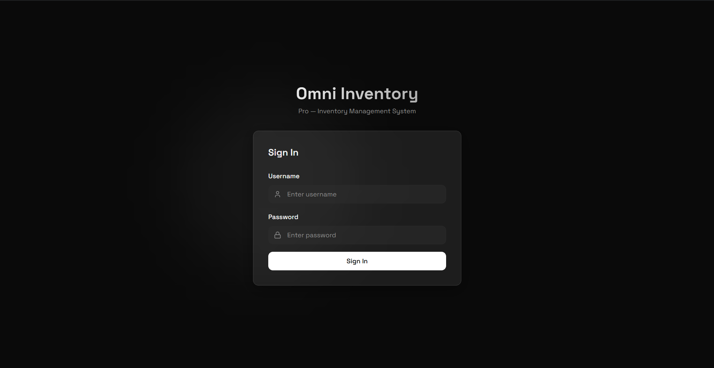
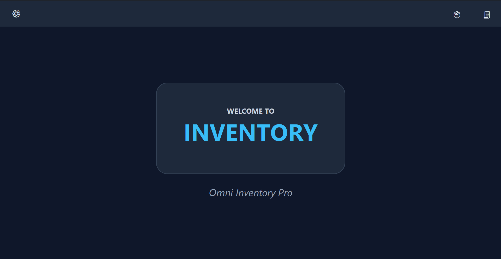
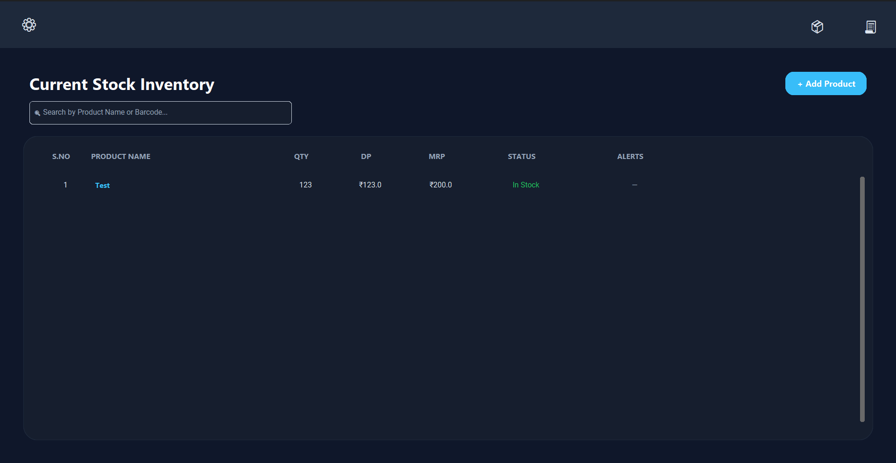
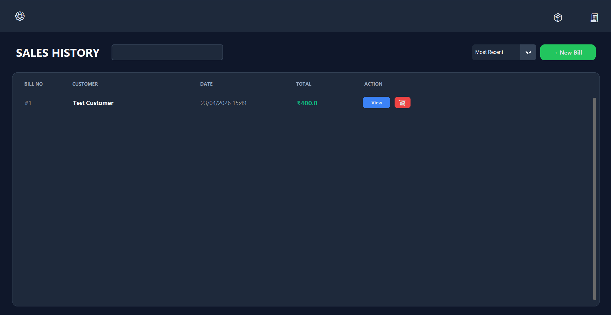
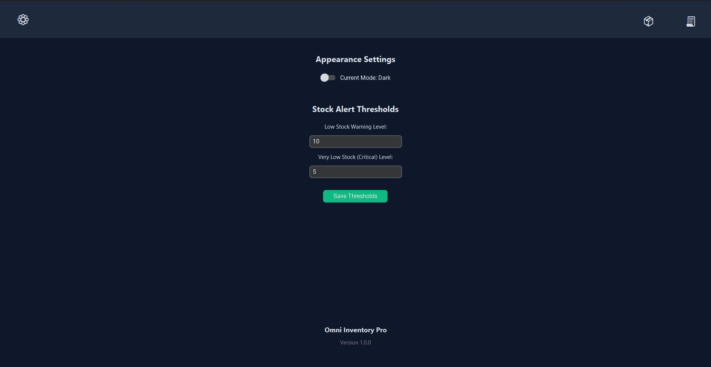

<p align="center">
<<<<<<< HEAD
  
=======
  
>>>>>>> 9f40005a738008f338658c65242a24e04ddcef97
</p>

<h1 align="center">Omni Inventory Pro</h1>

<p align="center">A lightweight, offline-first desktop inventory management system built for small businesses.</p>

<<<<<<< HEAD
<!-- 📸 IMAGE: Add a banner/hero image here. Wide screenshot of the welcome screen or dashboard. Recommended size: 1280×400px. Save as `screenshots/banner.png` and uncomment the line below. -->
<!--  -->

=======
>>>>>>> 9f40005a738008f338658c65242a24e04ddcef97
---

## About the Project

Omni Inventory Pro is a desktop application that helps small businesses manage their stock, generate bills, and track sales — all without needing an internet connection. It runs entirely on your local machine with a built-in database, making it fast, private, and simple to use.

This is **Version 1** of the app, built as a standalone Python desktop application.

<<<<<<< HEAD
<!-- 📸 IMAGE: Screenshot of the welcome/home screen. Save as `screenshots/welcome.png` and uncomment the line below. -->
=======

>>>>>>> 9f40005a738008f338658c65242a24e04ddcef97
<!--  -->

---

## Features

- **Inventory Management** — Add, edit, delete, and search products with full stock tracking
- **Billing & Invoicing** — Create bills, assign items to customers, and auto-update stock on sale
- **Bill History** — View, search, and manage all past bills with full item breakdowns
- **QR Code Verification** — Verify bills using QR code scanning via webcam
- **PDF Bill Generation** — Save bills as PDF documents with an embedded QR code
- **Stock Threshold Alerts** — Set low and very-low stock thresholds with visual status indicators
- **Dark / Light Mode** — Toggle between themes; preference is saved between sessions
- **Offline & Local** — No internet required; all data is stored in a local SQLite database

<<<<<<< HEAD
<!-- 📸 IMAGE: Screenshot of the inventory/product list screen. Save as `screenshots/inventory.png` and uncomment the line below. -->
<!--  -->

<!-- 📸 IMAGE: Screenshot of the billing screen with a bill being created. Save as `screenshots/billing.png` and uncomment the line below. -->
<!--  -->

<!-- 📸 IMAGE: Screenshot of the app in dark mode. Save as `screenshots/dark_mode.png` and uncomment the line below. -->
<!--  -->
=======

<!--  -->


<!--  -->

<!--  -->


<!--  -->
>>>>>>> 9f40005a738008f338658c65242a24e04ddcef97

---

## Libraries Used

| Library | Purpose |
|---|---|
| [CustomTkinter](https://github.com/TomSchimansky/CustomTkinter) | Modern themed UI framework built on top of Tkinter |
| [OpenCV (`opencv-python`)](https://github.com/opencv/opencv-python) | Webcam access for QR code scanning |
| [pyzbar](https://github.com/NaturalHistoryMuseum/pyzbar) | QR code and barcode decoding |
| [fpdf2](https://py-pdf.github.io/fpdf2/) | PDF generation for printed bills |
| [qrcode](https://github.com/lincolnloop/python-qrcode) | QR code generation embedded in bill PDFs |
| [SQLite3](https://docs.python.org/3/library/sqlite3.html) | Built-in Python library used for local database storage |
| [PyInstaller](https://pyinstaller.org/) | Packages the app into a standalone Windows `.exe` |

---

## Software Overview

Omni Inventory Pro V1 is built entirely in **Python**. The UI is built using **CustomTkinter**, a modern extension of Python's built-in Tkinter library that provides a clean, themed interface with support for both light and dark modes.

The app is structured across three main files: `ui.py` handles all screens and user interactions, `database.py` manages all data operations using a local **SQLite** database (`inventory.db`), and `printing_manager.py` handles PDF bill generation.

When you run the app, it initialises the database automatically on first launch, creating all required tables. From there, all data — products, bills, settings — is stored and read locally with no external server or internet connection required.

The app is packaged into a standalone Windows executable using **PyInstaller**, meaning end users do not need Python installed to run it.

---

## How to Use

### Running the Compiled App

If you have downloaded the compiled `.exe`, simply run it — no installation or Python required.

### Running from Source

1. Make sure you have **Python 3.10 or higher** installed — download from [python.org](https://www.python.org/downloads/)
2. Clone or download this repository
3. Install the required libraries:
   ```bash
   pip install customtkinter opencv-python pyzbar fpdf2 qrcode pyinstaller
   ```
4. Run the app:
   ```bash
   python ui.py
   ```

### Compiling the App

To build your own `.exe` from the source code, refer to the **[`app building command.txt`](app%20building%20command.txt)** file included in this repository. It contains the exact PyInstaller command and an explanation of every flag used.

You will need PyInstaller installed before building:
```bash
pip install pyinstaller
```

---

## License

Copyright (c) 2026 **DrkBlde**

This project is licensed under the **GNU General Public License v3.0**. See the [`LICENSE`](LICENSE) file for the full license text.

**In short:**

- ✅ You are free to use, modify, and distribute this software
- ✅ You must credit **DrkBlde** as the original author in any modified or redistributed version
- ✅ Any modified version you release must also be open source under GPL-3
- ❌ You may not use this software or any derivative of it for commercial purposes without first getting permission
- ❌ You may not claim this software as your own or release it under a different name without crediting the original author

> **For commercial use or any use beyond personal projects**, please open an issue before proceeding — see below.

---

## Issues, Bugs & Permission Requests

Found a bug, have a suggestion, or want to request permission for commercial use? Open an issue on the GitHub Issues page:

**[→ Open an Issue](../../issues)**

When reporting a bug, please include:
- What you were doing when the issue occurred
- Any error messages you saw
- Your operating system and Python version (if running from source)

When requesting commercial use permission, describe your intended use clearly and wait for a response before proceeding.
