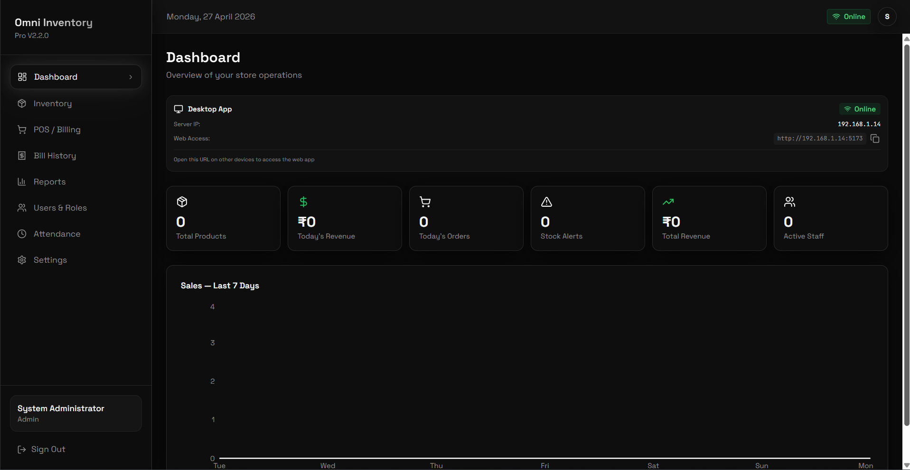
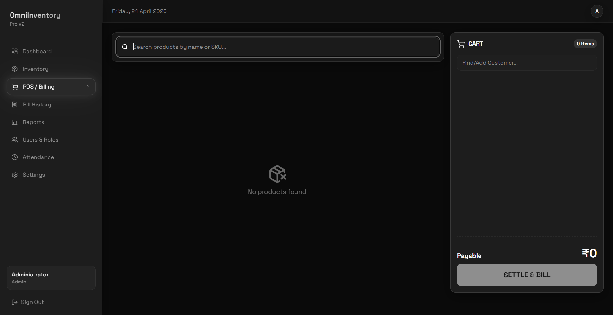
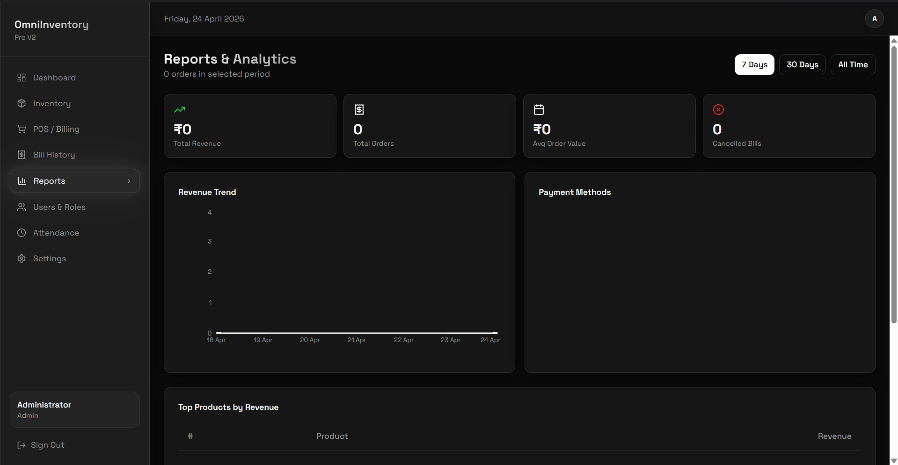
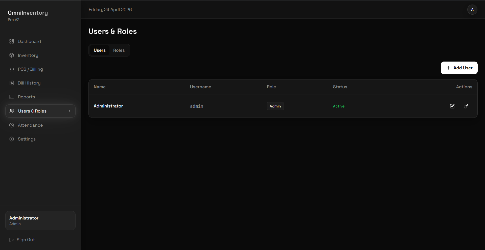

<p align="center">
  
</p>

<h1 align="center">Omni Inventory Pro</h1>

<p align="center">A full-featured, offline-first desktop inventory management system built for small businesses.</p>

<!-- 📸 IMAGE: Add a banner/hero image here. Wide screenshot of the dashboard. Recommended size: 1280×400px. Save as `screenshots/banner.png` and uncomment the line below. -->
<!--  -->

---

## About the Project

Omni Inventory Pro V2 is a complete rebuild of V1 — upgraded from a Python desktop app to a modern **Electron + React** desktop application. It introduces a full login system, role-based access control, a Point of Sale screen, staff attendance tracking, sales reports with charts, and much more. All data is stored locally using **SQLite**, with no internet connection required.

<!-- 📸 IMAGE: Screenshot of the dashboard showing stat cards and charts. Save as `screenshots/dashboard.png` and uncomment the line below. -->
<!--  -->

---

## Features

- **Login & Authentication** — Secure login system with hashed passwords; sessions are protected with role-based access control
- **Dashboard** — At-a-glance overview of today's revenue, total orders, stock alerts, expiry warnings, and a 7-day sales chart
- **Inventory Management** — Add, edit, delete, and search products with batch tracking, expiry dates, and stock threshold alerts
- **Point of Sale (POS)** — Full billing screen with product search, quantity selection, multi-payment support (cash, UPI, card), and bill generation
- **Bill History** — View, search, and manage all past bills with full item breakdowns and cancellation support
- **Reports** — Revenue trend charts, top products by revenue, and a pie chart breakdown of sales categories
- **User & Role Management** — Create users, define custom roles, assign granular permissions, and deactivate accounts
- **Staff Attendance** — Clock-in and clock-out tracking for staff members
- **App Settings** — Configure store name, currency, logo, stock thresholds, and perform full database resets
- **Offline & Local** — No internet required; all data is stored in a local SQLite database
- **MSI Installer** — Compiles into a Windows `.msi` installer for clean system-wide installation

<!-- 📸 IMAGE: Screenshot of the POS screen with items selected. Save as `screenshots/pos.png` and uncomment the line below. -->
<!--  -->

<!-- 📸 IMAGE: Screenshot of the inventory screen. Save as `screenshots/inventory.png` and uncomment the line below. -->
<!--  -->

<!-- 📸 IMAGE: Screenshot of the Reports page showing charts. Save as `screenshots/reports.png` and uncomment the line below. -->
<!--  -->

---

## Libraries & Technologies Used

| Library / Technology | Purpose |
|---|---|
| [Electron](https://www.electronjs.org/) | Desktop app shell — wraps the React frontend into a native Windows app |
| [React](https://react.dev/) + [TypeScript](https://www.typescriptlang.org/) | Frontend UI framework |
| [Vite](https://vitejs.dev/) | Frontend build tool and dev server |
| [Tailwind CSS](https://tailwindcss.com/) | Utility-first CSS framework for styling |
| [shadcn/ui](https://ui.shadcn.com/) + [Radix UI](https://www.radix-ui.com/) | Accessible, pre-built UI components |
| [Zustand](https://github.com/pmndrs/zustand) | Lightweight global state management |
| [Express](https://expressjs.com/) | Local backend server that handles database operations |
| [SQLite3](https://github.com/TryGhost/node-sqlite3) | Local database for all app data |
| [bcryptjs](https://github.com/dcodeIO/bcrypt.js) | Password hashing for secure login |
| [Recharts](https://recharts.org/) | Charts for the dashboard and reports pages |
| [React Router](https://reactrouter.com/) | Client-side routing between pages |
| [React Hook Form](https://react-hook-form.com/) + [Zod](https://zod.dev/) | Form handling and validation |
| [TanStack Query](https://tanstack.com/query) | Server state management and data fetching |
| [electron-builder](https://www.electron.build/) | Packages the app into a Windows `.msi` installer |
| [date-fns](https://date-fns.org/) | Date formatting and manipulation |
| [Lucide React](https://lucide.dev/) | Icon library |

---

## Software Overview

Omni Inventory Pro V2 is a complete rebuild using **TypeScript**, **React**, and **Electron**. The frontend is built with React and styled using Tailwind CSS with shadcn/ui components, giving it a clean, modern interface. Vite handles the frontend build and development server.

The app runs a local **Express** server in the background (started automatically by Electron on launch) which handles all database operations using **SQLite**. The frontend communicates with this local server via API calls — the same way a web app would, except everything runs entirely on your local machine with no internet required.

State is managed globally using **Zustand**, while React Hook Form and Zod handle form validation. The entire app is packaged into a Windows `.msi` installer using **electron-builder**, meaning end users get a clean one-click installation experience.

<!-- 📸 IMAGE: Screenshot of the Users & Roles page. Save as `screenshots/users.png` and uncomment the line below. -->
<!--  -->

---

## How to Use

### Running the Installed App

If you downloaded the `.msi` installer, run it and follow the on-screen steps. The app will be installed system-wide and a shortcut will be created automatically.

### Running from Source

1. Make sure you have **Node.js 18+** installed — download from [nodejs.org](https://nodejs.org/)
2. Clone or download this repository
3. Install dependencies:
   ```bash
   npm install
   ```
4. Run the app in development mode:
   ```bash
   npm run electron:dev
   ```

### Compiling the App

To build your own `.msi` installer from source, run:

```bash
npm run dist
```

This will first build the React frontend with Vite, then package everything into a Windows `.msi` installer using electron-builder. The output will be in the `dist_msi/` folder.

Make sure all dependencies are installed (`npm install`) before building.

---

## What Changed from V1

| | V1 | V2 |
|---|---|---|
| Language | Python | TypeScript + React |
| UI Framework | CustomTkinter | Electron + shadcn/ui |
| Database | SQLite via Python | SQLite via Node/Express |
| Login System | ❌ | ✅ |
| Role-Based Access | ❌ | ✅ |
| Dashboard & Charts | ❌ | ✅ |
| POS Screen | Basic billing | Full POS with payments |
| Reports | ❌ | ✅ |
| Staff Attendance | ❌ | ✅ |
| Installer | `.exe` (PyInstaller) | `.msi` (electron-builder) |

---

## License

Copyright (c) 2026 **DrkBlde**

This project is licensed under the **GNU General Public License v3.0**. See the [`LICENSE`](LICENSE) file for the full license text.

**In short:**

- ✅ You are free to use, modify, and distribute this software
- ✅ You must credit **DrkBlde** as the original author in any modified or redistributed version
- ✅ Any modified version you release must also be open source under GPL-3
- ❌ You may not use this software or any derivative of it for commercial purposes without first getting permission
- ❌ You may not claim this software as your own or release it under a different name without crediting the original author

> **For commercial use or any use beyond personal projects**, please open an issue before proceeding — see below.

---

## Issues, Bugs & Permission Requests

Found a bug, have a suggestion, or want to request permission for commercial use? Open an issue on the GitHub Issues page:

**[→ Open an Issue](../../issues)**

When reporting a bug, please include:
- What you were doing when the issue occurred
- Any error messages you saw
- Your Node.js version and operating system

When requesting commercial use permission, describe your intended use clearly and wait for a response before proceeding.
